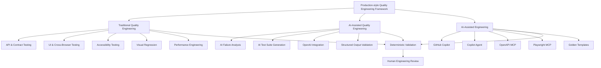

# Hi, I'm Szabolcs 👋

**Senior SDET · Quality Engineering**

I design and build maintainable Quality Engineering systems with a focus on **architecture, deterministic execution, reproducibility, meaningful quality signals, and engineering evidence**.

My current work centers on a production-style Playwright + TypeScript engineering system spanning **API and contract testing, database persistence validation, browser automation, accessibility, visual regression, performance testing, Docker, CI/CD, failure diagnostics, and AI-assisted Quality Engineering**.

### [Explore my Quality Engineering Portfolio →](https://szabihudak.github.io/quality-engineering-showcase/)

---

## Quality Engineering Model

The engineering system combines **traditional Quality Engineering, framework-owned AI-assisted Quality Engineering, and repository-aware AI-assisted engineering**.

AI operates within deterministic validation and human engineering ownership rather than replacing the engineering system.

---

## 🧪 Quality Engineering Portfolio

The **[Quality Engineering Showcase](https://szabihudak.github.io/quality-engineering-showcase/)** is the presentation and evidence layer for my current engineering work.

It provides a structured path through the system:

- **API & Contract Testing**: domain API clients, TypeBox schemas, AJV runtime validation
- **Database Validation**: typed PostgreSQL access and persistence validation
- **UI & Cross-Browser Testing**: Playwright, Page Objects, fixtures, Chromium, Firefox, WebKit
- **Accessibility Testing**: axe-core, WCAG-oriented automated quality gates, real defect evidence
- **Visual Regression**: deterministic Playwright screenshot testing with reviewed Linux baselines
- **Performance Engineering**: k6 API performance, Lighthouse CI, authenticated Lighthouse execution
- **CI/CD & Containers**: Docker, GitHub Actions, GHCR, responsibility-based execution
- **Failure Diagnostics**: reports, GitHub-native summaries, and execution artifacts used for structured root-cause analysis
- **AI-Assisted Quality Engineering**: AI Failure Analysis, AI Test Suite Generation, repository-aware Copilot workflows, Golden Templates, and human-review boundaries
- **AI-Assisted Engineering Validation**: Copilot Agent workflows, OpenAPI MCP contract discovery, and Playwright MCP browser exploration with deterministic validation

The portfolio connects **engineering claims to inspectable evidence** rather than presenting capabilities as a checklist alone.

**[Open Portfolio Site →](https://szabihudak.github.io/quality-engineering-showcase/)**  
**[View Showcase Repository →](https://github.com/szabihudak/quality-engineering-showcase)**

---

## ⚙️ Runnable Public Framework

### [Playwright Enterprise Framework](https://github.com/szabihudak/playwright-enterprise-framework)

A standalone public **Playwright + TypeScript** framework demonstrating the core API, UI, contract-validation, cross-browser, Docker, and CI engineering patterns represented throughout the portfolio.

It can be inspected, cloned, and executed independently.

Key implementation areas include:

- API and browser automation
- Schema-based runtime contract validation
- Programmatic authentication
- Deterministic test-data and fixture architecture
- Page Object and Component Object design
- Network mocking
- Chromium, Firefox, and WebKit execution
- Dockerized execution
- GitHub Actions CI/CD
- Failure diagnostics and test artifacts
- Architecture Decision Records and engineering standards

**[Inspect the Runnable Framework →](https://github.com/szabihudak/playwright-enterprise-framework)**

---

## 🏗️ Engineering Focus

I am particularly interested in:

- Quality Engineering and test automation architecture
- Deterministic and maintainable test systems
- API and runtime contract validation
- Database and persistence validation
- Explicit execution ownership and quality gates
- Reproducible containerized CI/CD
- Accessibility, visual, and performance quality signals
- Failure diagnostics and evidence-driven engineering
- AI-assisted Quality Engineering with deterministic validation and human review
- Repository-aware AI engineering workflows and MCP-assisted discovery
- Engineering trade-offs and technical decision-making

---

## 🛠️ Technology

`Playwright` · `TypeScript` · `Node.js` · `PostgreSQL` · `TypeBox` · `AJV` · `axe-core` · `k6` · `Lighthouse` · `Docker` · `GitHub Actions` · `GHCR` · `OpenAI` · `GitHub Copilot` · `OpenAPI MCP` · `Playwright MCP`

---

## 🚀 Current Direction

The current framework v1.0 engineering foundation covers API, database, browser, accessibility, visual, performance, containerized execution, CI/CD, diagnostics, framework-owned AI capabilities, and validated AI-assisted engineering workflows.

The next areas of development extend that foundation into:

**AI-Native QA Platform Evaluation → QE Strategy & Leadership → System Design, Security & Observability**

The current AI-native platform evaluation focuses on **mabl**, including AI-native test creation, adaptive and self-healing behavior, maintainability, diagnosis transparency, CI/CD integration, developer control, and build-versus-buy trade-offs.

The detailed engineering roadmap is maintained in the **[Quality Engineering Showcase](https://szabihudak.github.io/quality-engineering-showcase/roadmap/)**.

---

## 📫 Connect

- [LinkedIn](https://www.linkedin.com/in/szabolcs-v-hudak/)
- [GitHub](https://github.com/szabihudak)
- [Quality Engineering Portfolio](https://szabihudak.github.io/quality-engineering-showcase/)
